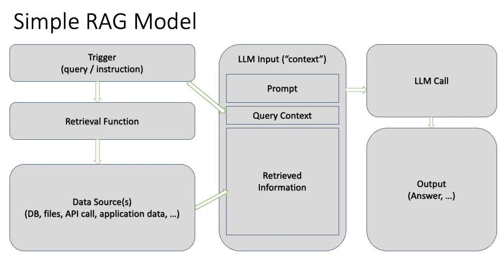

# PolkAI

It is usually difficult to find good documentation in the early phase of a project, or during extensive modifications. Search engines are either do not return hits, or very noisy because many sources (like forums and chat archives) are polluted with outdated information. This makes the onboarding of both users and developers difficult.

A custom ChatGPT instance augmented with up-to-date knowledgebase and API calling capability can be a possible solution for this problem with some added benefits:

- Contains the latest information
- Helps the onboarding of users even if the documentation is very technical and long
- Translation into different languages is available (however it is already possible with other tools as well)
- It can even interact with the blockchain (or any other system) to provide near real-time information to the user

This project consists of the following parts:

_polkai:_
ETL (extract, transform, load) pipeline for training the model. It extracts and preprocess information that is loaded into custom GPT.
Supported sources:

- websites
- Github repositories
- Youtube video transcripts

_polkai-api:_

Static landing page and serverless REST API-s implementing the blockchain interaction services.

_sitemap2docext:_

forked from sitemap2doc available at: https://github.com/lacastar/sitemap2doc

changes:

- supports local sitemaps produced by crawlers when a sitemap.xml is not available or not complete
- text is "unfluffed" for better GPT tokenization results

Custom ChatGPT instance
A custom instance must be configured at https://chat.openai.com/ The knowledge extracts from polkai are loaded as additional sources and polkai-api swagger is configured for RAG (Retrieval-Augmented Generation).

## Problems

GPT is extremely sensitive to information quality: unfortunately the source websites are really badly structured.
Code generation is not working...
Some form of authentication would be nice between GPT and the API.
Only GPT Plus subscribers can access the chat.

## Why ChatGPT

At the moment no other provider supports this setup oob. It is possible to program and configure such a system, but due to the time constraint this option was not viable.
In the long run a self-hosted AI model is preferable, however at the moment it would have been even more time and resource consuming.

## Possibilities

- Loading better quality information into the knowledgebase - or training the model with it directly - for better quality answers.
- Get code generation working.
- Implement write transactions - if it is even a good idea? (The AI could select and configure the right transaction and network, these parameters can be sent to the user for review, signature and submission.)
